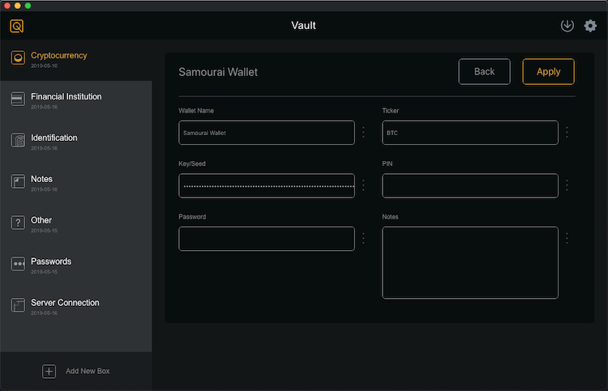

# Qvault

An open source, fully transparent and extremely secure password manager

https://qvault.io

[](https://travis-ci.org/Q-Vault/qvault)
[](https://github.com/Q-Vault/qvault/releases)
[](https://snyk.io/test/github/q-vault/qvault)

## Contact Qvault

[](https://twitter.com/intent/follow?screen_name=q_vault)
[](https://discord.gg/EEkFwbv)
[](https://medium.com/qvault)

## Features

* Open source - as all password managers should be
* Offline mode - optional
* Dual encryption using physical Qvault cards - optional
* Recovery code in case master password is forgotten - optional
* Simple - all encrypted vaults are stored locally in .qvault files
* Free cloud backup storage - optional
* Virtual keyboard to bypass keylogger malware
* Import passwords from a CSV (most browsers can export to CSV)
* Windows, Mac and Linux
* All windows and mac releases are code signed and updates are optional (prompted) within the app

<p align="center">
    
</p>

## Contributing

We love help! Contribute by forking the repo and opening pull requests. Please ensure that your code passes the existing tests, and write tests to test your changes if applicable.

All pull requests should be submitted to the "master" branch. Code in the "prod" branch is live in the latest release.

### Quickstart

#### Clone and enter the repo

```bash
git clone https://github.com/q-vault/qvault
cd qvault
```

#### Install dependencies

We use yarn as opposed to npm due it being recommended by most electron tools.

```bash
yarn install
```

#### Run development application

```bash
yarn dev
```

### Cloud Server

Users can choose to optionally store their encrypted vault on Qvault's servers. The API that Qvault uses is hosted at https://api.qvault.io

The only version of Qvault at any moment that is guaranteed to work nicely with the cloud server is the latest release,
although we do our best to maintain backwards compatibility. Please update accordingly.

In the future we plan to open source the server code and allow users to change their host address within the app.

### Linting and Styling

Qvault uses eslint and all pull requests must pass the eslint tests. Make sure your code adheres to the rules defined in [.eslintrc.json](.eslintrc.json)

To run the linting tests:

```bash
yarn lint
```

To try to autofix the repo:

```bash
yarn lint-fix
```

Some general rules that Qvault follows additionaly:

* All javascript filenames, functions, and variables are camelCase
* All vue filenames and components are PascalCase

### Node Version - NVM

NVM, or node version manager, is used to keep track of the supported node version. If you are having strange node api errors, be
sure to set the correct node version:

```bash
nvm use
```

### Run Tests

Mocha Chai

```bash
yarn test
```

## Build from source

Building from source is the best way to ensure code integrity, but keep in mind auto-updates will not work.

```bash
yarn release --publish never
```

## Helpful VSCode settings

These are the repo-level settings some of us use in vscode. We also recommend using the eslint plugin by Dirk Baeumer.

```json
{
    "editor.formatOnSave": false,
    "files.eol": "\n",
    "eslint.validate": [
        {
            "language": "vue",
            "autoFix": true
        },
        {
            "language": "javascript",
            "autoFix": true
        }
    ],
    "eslint.autoFixOnSave": true
}
```

## Contact the Devs

The best way to get in contact with the developers is on the public discord server.

[](https://discord.gg/EEkFwbv)

Also follow Lane or contact him on twitter or medium

[](https://medium.com/@lane.c.wagner)
[](https://twitter.com/intent/follow?screen_name=wagslane)
